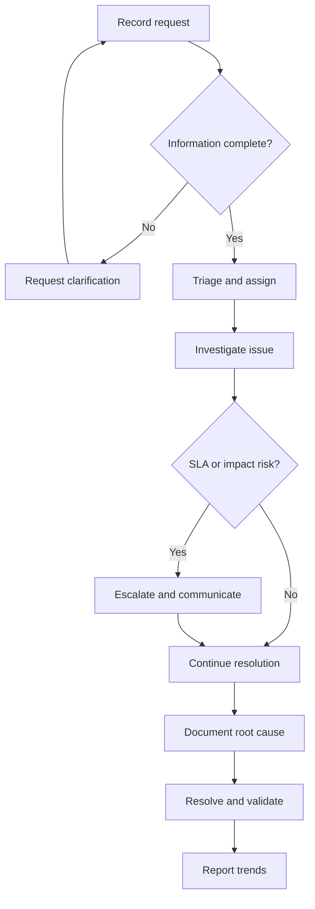
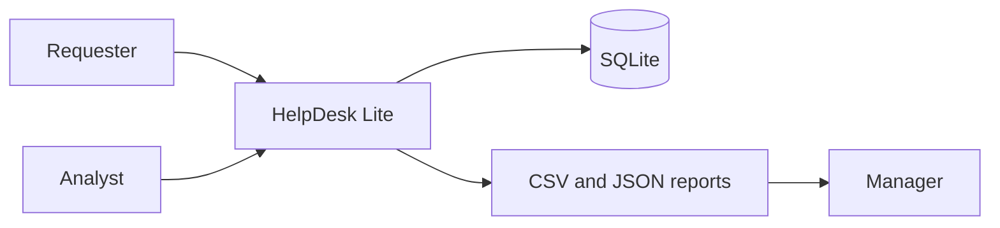

# Use Cases and Process Model

## Use cases

### UC-01 — Record an operational issue

**Actor:** Requester or service desk analyst  
**Precondition:** The user can access the intake form.  
**Main flow:**

1. The user records requester, device, location, category, business impact, and issue details.
2. The user assigns a priority and operational team.
3. The application validates required fields.
4. The application creates an open ticket, assigns the priority-based SLA, and writes a creation event.

**Exception:** Missing or invalid information returns a validation message and does not create a ticket.

### UC-02 — Investigate and update a ticket

**Actor:** Service desk analyst  
**Main flow:**

1. The analyst reviews the issue and audit history.
2. The analyst records investigation notes and updates priority, assignment, or impact.
3. The application preserves timestamped notes and writes change events.

### UC-03 — Escalate an SLA breach

**Actor:** Support lead or scheduled automation  
**Main flow:**

1. Python executes a SQL query for active, non-escalated tickets beyond SLA.
2. Matching tickets are escalated in a single transaction.
3. An audit event is written for each ticket.
4. The support lead reviews the refreshed SLA queue.

### UC-04 — Complete root-cause and resolution documentation

**Actor:** Operational team  
**Main flow:**

1. The team records root cause, resolution summary, and any change reference.
2. Status is changed to resolved or closed.
3. The application records the resolution timestamp and audit history.

### UC-05 — Review operational performance

**Actor:** Business manager  
**Main flow:**

1. The manager opens the analytics dashboard.
2. SQL queries calculate portfolio metrics, recurring categories, SLA risk, and data-quality gaps.
3. The manager exports the SLA CSV or runs the Python JSON report for downstream reporting.

## Process model

## System context

